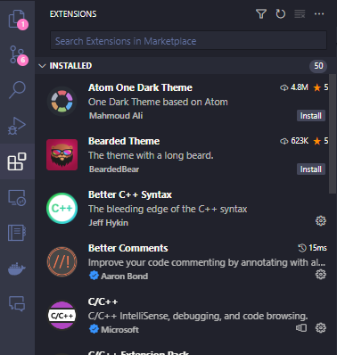

# Python公式版の環境構築
このページでは、Python公式版の環境構築について説明します。
!!! note
    このページでは、Python公式版のインストール方法を説明します。
    Anacondaをインストールしたい場合は、[こちら](setup_anaconda.md)を参照してください。

## Python公式版のインストール
!!! warning
    Pre-releasesは使用しないでください。必ず、Stable Releasesを使用してください。

### Windows
1. [Python公式ウェブサイト](https://www.python.org/downloads/)にアクセスします。
1. "Downloads" タブをクリックします。
1. "Python Releases for Windows" セクションまでスクロールします。
1. インストールしたいバージョンを選択します（例：Python 3.9.7）。
1. Windows installer (64-bit)リンクをクリックし、インストーラーをダウンロードします。
1. インストーラーを実行し、画面の指示に従います。
!!! note
    インストールプロセス中に "Add Python to PATH" のチェックボックスを確認してください。
1. インストールが完了したら、コマンドプロンプトを開き、`python --version` と入力してインストールを確認します。

### Mac
1. ウェブブラウザを開き、[Python公式ウェブサイト](https://www.python.org/downloads/)にアクセスします。
1. "Downloads" タブをクリックします。
1. "Python Releases for Mac OS X" セクションまでスクロールします。
1. インストールしたいバージョンを選択します（例：Python 3.9.7）。
1. macOS インストーラーリンクをクリックします。
1. インストーラーを実行し、画面の指示に従います。
1. インストールが完了したら、ターミナルを開き、`python3 --version` と入力してインストールを確認します。

### Linux
1. ターミナルを開きます。
1. 以下のコマンドを実行してパッケージリストを更新します：
    ```bash
    sudo apt update
    ```
1. 以下のコマンドを実行してPythonをインストールします：
    ```bash
    sudo apt install python3
    ```
1. インストールを確認するために、ターミナルで `python3 --version` と入力します。

## エディタ
さて、Pythonをインストールしたら、次はエディタをインストールしましょう。  
エディタは、Pythonのコードを書くためのソフトウェアです。
メモ帳を使ってもいいですが、エディタを使うとコーディングがしやすくなります。わかりやすく言うと、幸せになれます。

エディタにはいろんな種類があり、

- Visual Studio Code
- Atom
- Emacs
- Vim
- Sublime Text 3
- Eclipse

などなど、色々あります。どれを使っても構いません。

執筆者は、Visual Studio Codeを使っています。
Visual Studio Codeは、Microsoftが開発したエディタで、めちゃくちゃいっぱい拡張機能があって、もう何かとりあえず便利です（語彙力）。

### Visual Studio Codeの環境構築
Visual Studio Codeのインストール方法は、[こちら](https://code.visualstudio.com/download)を参照してください。

インストールが完了したら、Visual Studio Codeを起動し、左側のメニューから"Extensions"をクリックします。
すると、以下のような画面が表示されます：  


以下の拡張機能をインストールします：

- Python Extension Pack
- zenkaku
- indent-rainbow
- Trailing Spaces
- Japanese Language Pack for Visual Studio Code

上記の拡張機能をインストールしたら、Visual Studio Codeを再起動します。
これで、全角半角スペースやインデントがわかりやすくなり、デバッグが容易になります。
また、日本語化もできるようになります。

## まとめ
- Python公式版は、[Python公式ウェブサイト](https://www.python.org/downloads/)からダウンロードできます。
- エディタは、Visual Studio Codeを使うと便利です。
- Visual Studio Codeの拡張機能をインストールすると、デバッグが容易になります。

（完全な余談）執筆者はDracula OfficialというThemeを使っています。興味があれば、調べてみてください。